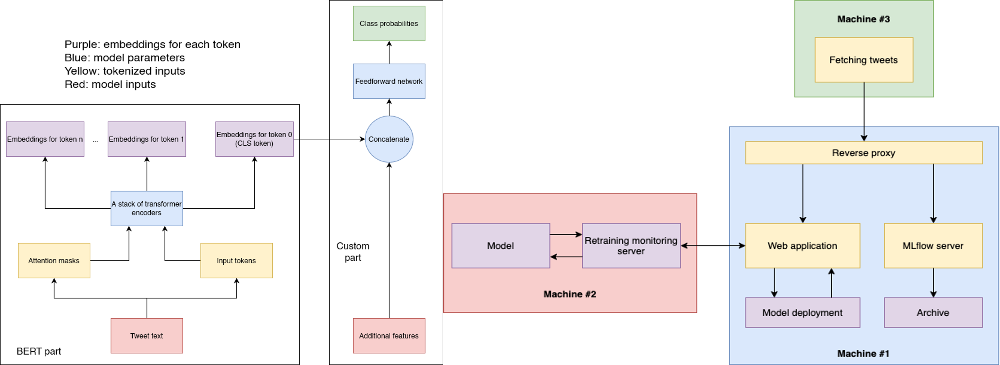

# Viral tweets MLOps project

<figure>
  
  <figcaption><i>ML model and pipeline architectures.</i></figcaption>
</figure>

Forked from [the original repository](https://github.com/Mallonbacka/viral-tweets).

Please check out [our project documentation](https://sonalexle.github.io/viral-tweets/) for more details.

## Introduction

* Machine learning (ML) pipeline for predicting the virality of Twitter posts, or tweets.

* Scraping a large number of tweets with [Twint](https://github.com/twintproject/twint),

* performing exploratory data analysis,

* selecting a final ML model: BERT [2] (67% accuracy),

* and deploying it on a set of host machines capable of continuously *fetching new tweets, retraining and redeploying the model if necessary*.

* Completed as a part of the CS-C3250 Data Science Project course at Aalto University, under the supervision of a [Futurice](https://futurice.com/) company representative.

* Main goal: to learn the MLOps framework.

* Instead of using ready made tools from cloud providers, we write code that can be set up on any machine.

* Key tools and libraries: PyTorch [4], Transformers [8] for model training; MLflow for model monitoring; Flask for model deployment and pipeline integration.

## Contributors

We had an agile and flexible development process.

* Son ([@SonAlexLe](https://github.com/SonAlexLe)): helped the group navigate through the project; researched cloud options (GCP); wrote PyTorch scripts for data preprocessing and training BERT; coordinated model development with pipeline development.

* Matthew ([@Mallonbacka](https://github.com/Mallonbacka)): continuous and fault-tolerant data scraping.

* Pawel ([@Taikelenn](https://github.com/Taikelenn)): researched cloud options (Azure); mainly implemented and integrated the pipeline components: data downloading, model (re)training, model (re)deployment.

* Sergey ([@zakuraevs](https://github.com/zakuraevs)): researched cloud options (AWS); prototyped on AWS; researched pipeline components; drafted the pipeline.

* Long ([@normsie](https://github.com/normsie)): exploratory data analysis (EDA); researched ML models with TF-IDF [6] text vectorization; tried BERT hyperparameter tuning.

* Hafsa ([@salehi-Hafsa](https://github.com/salehi-Hafsa)): EDA; researched ML models with Doc2Vec [3] text vectorization.

* Binh ([@pdtbinh](https://github.com/pdtbinh)): prototyped BERT code in TensorFlow; EDA; helped Long, Hafsa, and Son with their approaches.