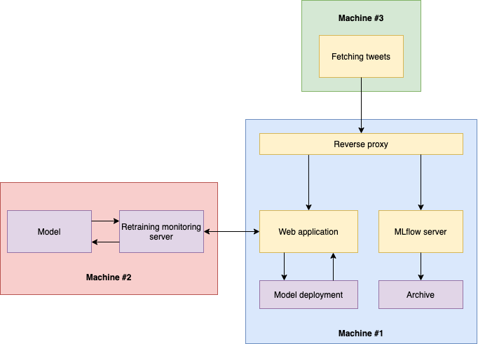
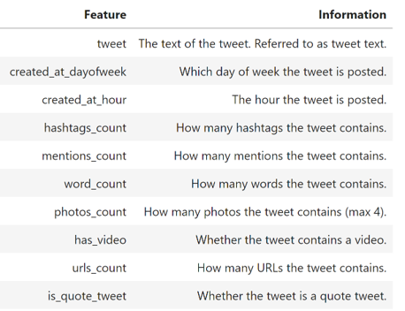

# Viral tweets MLOps project

<figure>
  
  <figcaption><i>Simplified model architecture.</i></figcaption>
</figure>

<figure>
  
  <figcaption><i>MLOps pipeline architecture.</i></figcaption>
</figure>

Forked from [the original repo](https://github.com/Mallonbacka/viral-tweets).

*test
{:toc}

## Introduction

* Machine learning (ML) pipeline for predicting the virality of Twitter posts, or tweets.

* Scraping a large number of tweets with [Twint](https://github.com/twintproject/twint),

* performing exploratory data analysis,

* selecting a final ML model: BERT [2] (67% accuracy),

* and deploying it on a set of host machines capable of continuously *fetching new tweets, retraining and redeploying the model if necessary*.

* Completed as a part of the CS-C3250 Data Science Project course at Aalto University, under the supervision of a [Futurice](https://futurice.com/) company representative.

* Main goal: to learn the MLOps framework.

* Instead of using ready made tools from cloud providers, we write code that can be set up on any machine.

* Key tools and libraries: PyTorch [4], Transformers [8] for model training; MLflow for model monitoring; Flask for model deployment and pipeline integration.

## Contributors

We had an agile and flexible development process.

* Son ([@SonAlexLe](https://github.com/SonAlexLe)): helped the group navigate through the project; researched cloud options (GCP); wrote PyTorch scripts for data preprocessing and training BERT; coordinated model development with pipeline development.

* Matthew ([@Mallonbacka](https://github.com/Mallonbacka)): continuous and fault-tolerant data scraping.

* Pawel ([@Taikelenn](https://github.com/Taikelenn)): researched cloud options (Azure); mainly implemented and integrated the pipeline components: data downloading, model (re)training, model (re)deployment.

* Sergey ([@zakuraevs](https://github.com/zakuraevs)): researched cloud options (AWS); prototyped on AWS; researched pipeline components; drafted the pipeline.

* Long ([@normsie](https://github.com/normsie)): exploratory data analysis (EDA); researched ML models with TF-IDF [6] text vectorization; tried BERT hyperparameter tuning.

* Hafsa ([@salehi-Hafsa](https://github.com/salehi-Hafsa)): EDA; researched ML models with Doc2Vec [3] text vectorization.

* Binh ([@pdtbinh](https://github.com/pdtbinh)): prototyped BERT code in TensorFlow; EDA; helped Long, Hafsa, and Son with their approaches.

## Web application

Since we did not deploy the web application of our project, we provide screenshots of it below.

<figure>
  
  <figcaption><i>The main UI of the app.</i></figcaption>
</figure>

<figure>
  
  <figcaption><i>An example tweet.</i></figcaption>
</figure>

<figure>
  
  <figcaption><i>Inference results of the example tweet.</i></figcaption>
</figure>

## Data description

<figure>
  
  <figcaption><i>From raw tweets scraped with Twint, we engineered 10 features, including the main text.</i></figcaption>
</figure>

The original training data included about 800 thousand tweets about Covid-19.
There are either weak or almost nonexistent correlations between the above features.

## Data collection

The original Twint configuration was wrapped inside a script which collected a set number of tweets, sampled from random intervals during a day.
This script was also responsible for removing clearly incompatible tweets (Twint’s filters had some limitations).
Collection continued until these filtered tweets matched a certain threshold (typically around 50,000 tweets), at which time the scraping stopped.
The scraping is triggered at the same time each day by a cron job.

## ML development

For simplicity and ease of final model deveopment, the **ML problem** is to classify whether a tweet gets more than zero likes or not.

Inspired by [1], We tried classical ML approaches such as Scikit-learn [5] models with Doc2Vec [3] and TF-IDF [6] text vectorization methods but failed to get a working model.

In the end, we got a working model in the form of a neural network based on the TinyBERT [7] variant of the BERT [2] language model.

<figure>
  
  <figcaption><i>BERT-based model architecture.</i></figcaption>
</figure>

<figure>
  
  <figcaption><i>Model evaluation metrics.</i></figcaption>
</figure>

## Pipeline development

### AWS prototyping

Having started the implementation, we quickly faced two significant problems. First, the use of AWS services at a scope that we were interested
in—tens of thousands of tweets—got us across the free tier limit. Second, we learned that going outside the boundaries of AWS tutorials on ML, e.g., using our own containerised model, was harder than expected. It would take significantly more time and money to build a pipeline we had envisioned. While this turn of events was unexpected, we believe it is representative of the real world where requirements, budgets and circumstances change continuously.

### Physical machines

The team swiftly designed an alternative to AWS. We would use a similar architecture, but would deploy the pipeline on a set of hosts owned by one of the team members. This would free us from the financial constraints and allow for flexibility with respect to the way we would integrate the individual parts. In the end, we built a set of code scripts capable of running on any computer, given the environment has been properly set up. We leave to future work the adoption of these scripts to cloud environments.

<figure>
  
  <figcaption><i>Final pipeline architecture.</i></figcaption>
</figure>

The pipeline is meant to spread across three machines. Machine 1 hosts a Flask server with the main web application, the latest deployment of the model responsible for live inference, and an MLflow server for tracking metrics and models. Machine 2 is equipped with powerful GPUs and is responsible for data preprocessing, training, and training monitoring via the MLflow server. Machine 3 scrapes new tweets from the web and stores them.

### Retraining

Retraining occurs whenever a new batch of tweets has been collected. The new data are split into a train set and test set. The model is retrained on the train set. Before deploying the newly retrained model, it is compared against the currently deployed model on the test set. The better model of the two is then deployed for live inference with the web application. In this way, we simulate the following scenario: the production model is continuously redeployed to ensure that it reflects the environment it lives in which is constantly changing due to, e.g., data drift or concept drift. Therefore, the model "grows" as the environment changes, resulting in a continuous lifecycle.

## References

1. Daga, I., Gupta, A., Vardhan, R. and Mukherjee, P., 2020. Prediction of likes and retweets using text information retrieval. Procedia Computer Science, 168, pp.123-128.

2. Devlin, J., Chang, M.W., Lee, K. and Toutanova, K., 2018. BERT: Pre-training of deep bidirectional transformers for language understanding. In Proceedings of the 2019 Conference of the North American Chapter of the Association for Computational Linguistics: Human Language Technologies, Volume 1 (Long and Short Papers).

3. Le, Q. and Mikolov, T., 2014, June. Distributed representations of sentences and documents. In Proceedings of the 31st International Conference on Machine Learning (ICML), pp. 1188-1196. PMLR.

4. Paszke, A., Gross, S., Massa, F., Lerer, A., Bradbury, J., Chanan, G., Killeen, T., Lin, Z., Gimelshein, N., Antiga, L. and Desmaison, A., 2019. PyTorch: An imperative style, high-performance deep learning library. Advances in neural information processing systems (NeurIPS), 32, pp. 8026-8037.

5. Pedregosa, F., Varoquaux, G., Gramfort, A., Michel, V., Thirion, B., Grisel, O., Blondel, M., Prettenhofer, P., Weiss, R., Dubourg, V. and Vanderplas, J., 2011. Scikit-learn: Machine learning in Python. The Journal of Machine Learning Research (JMLR), 12, pp. 2825-2830.

6. Roelleke, T. and Wang, J., 2008. TF-IDF uncovered: a study of theories and probabilities. In Proceedings of the 31st annual international ACM SIGIR conference on Research and development in information retrieval (pp. 435-442).

7. Turc, I., Chang, M.W., Lee, K. and Toutanova, K., 2019. Well-read students learn better: On the importance of pre-training compact models. arXiv preprint arXiv:1908.08962.

8. Wolf, T., Chaumond, J., Debut, L., Sanh, V., Delangue, C., Moi, A., Cistac, P., Funtowicz, M., Davison, J., Shleifer, S. and Louf, R., 2020. Transformers: State-of-the-art natural language processing. In Proceedings of the 2020 Conference on Empirical Methods in Natural Language Processing: System Demonstrations (pp. 38-45).
